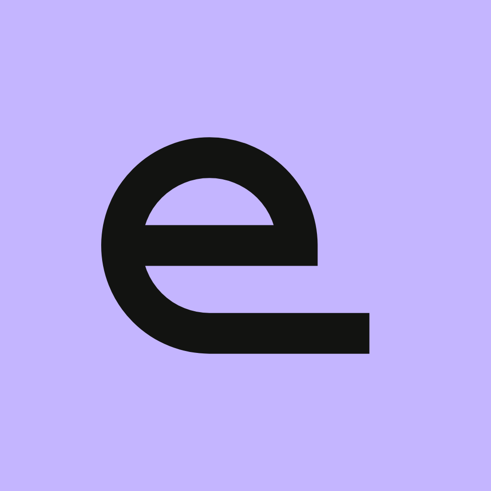
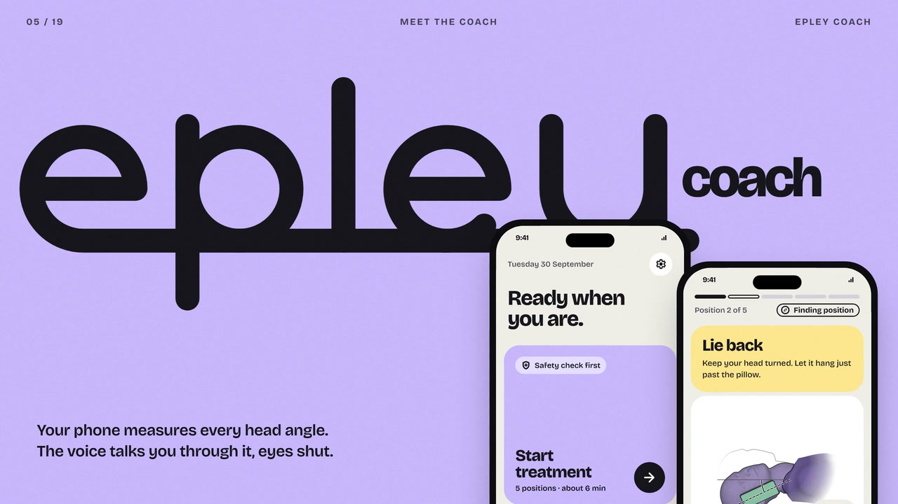
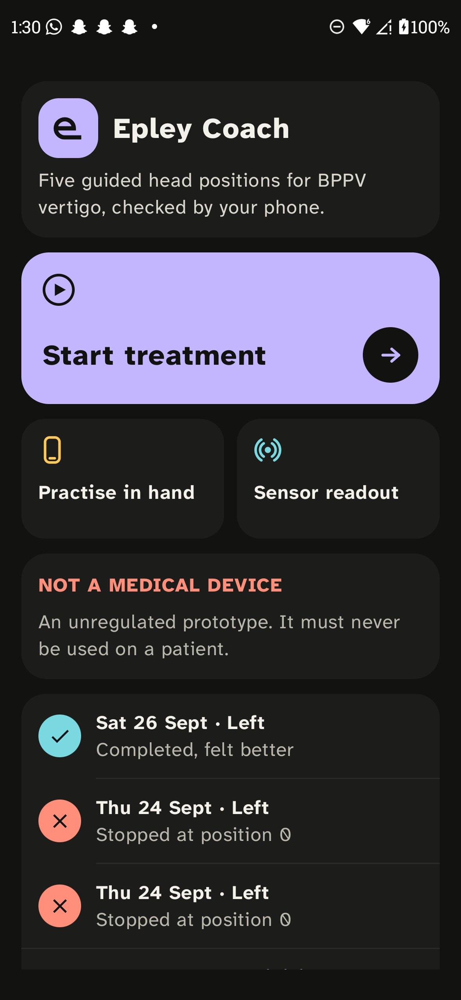
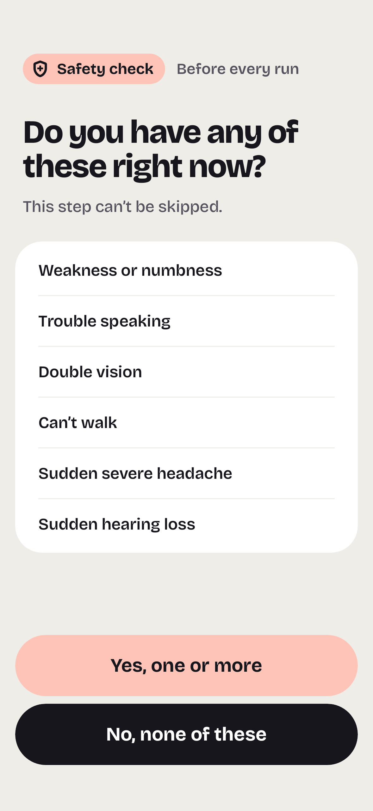
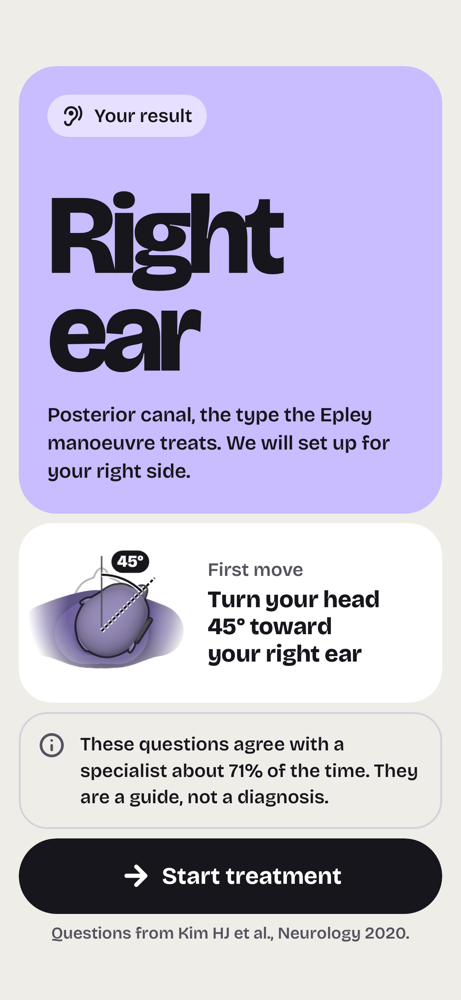
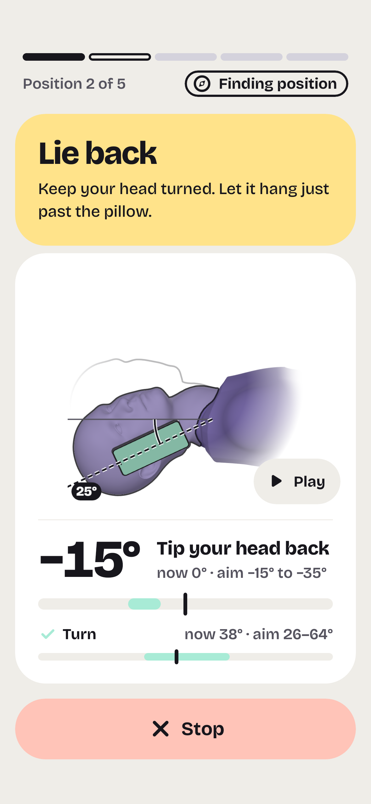
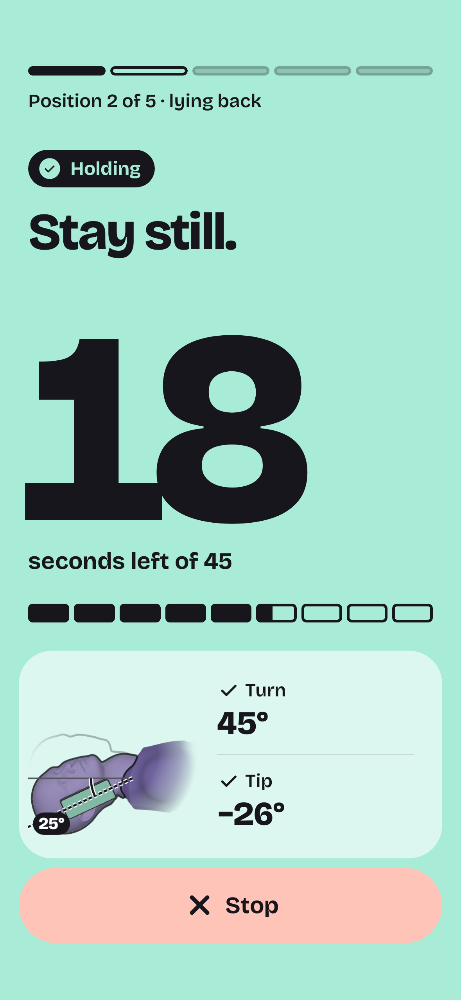
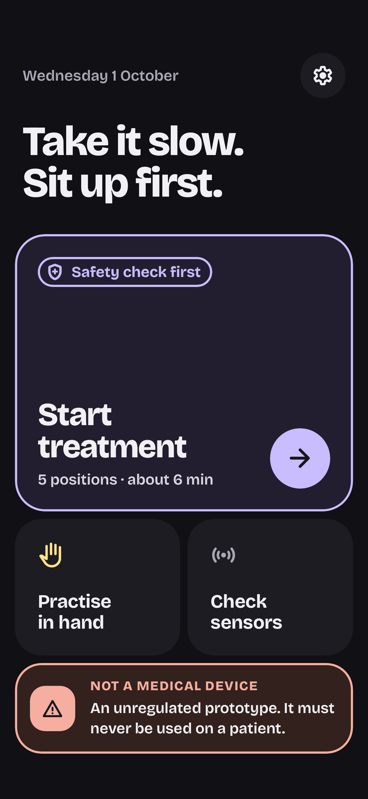

<div align="center">



# Epley Coach

**Your phone becomes the angle gauge for the five-minute vertigo treatment, and it won't start the timer until your head is actually in position.**

[](#try-it)
[](#how-it-works)
[](#how-it-works)
[](#revenuecat-integration)
[](LICENSE)
[](#tests)

Built by a student for **RevenueCat Shipaton 2026**, Next Gen track.

</div>

---

## Demo

<div align="center">

<a href="https://youtu.be/F9ePwouzgn4">
  
</a>

**[Watch the demo on YouTube](https://youtu.be/F9ePwouzgn4)**

</div>

## Screenshots

<table align="center">
  <tr>
    <td align="center"><br><sub><b>Home</b>: one action per screen</sub></td>
    <td align="center"><br><sub><b>Safety check</b>: before every run</sub></td>
    <td align="center"><br><sub><b>Ear result</b>: from six questions</sub></td>
  </tr>
  <tr>
    <td align="center"><br><sub><b>Guided position</b>: 3D head, both angles live</sub></td>
    <td align="center"><br><sub><b>Hold</b>: counts only in range and still</sub></td>
    <td align="center"><br><sub><b>Night mode</b>: for 3 a.m. episodes</sub></td>
  </tr>
</table>

## The problem

BPPV is the most common cause of vertigo. The Epley manoeuvre treats it: five head positions,
about five minutes, free, no medication. It only works if the head is at the right angles and the
right ear is treated, and that is where home treatment goes wrong.

| | | Source |
|---|---|---|
| BPPV lifetime prevalence | **2.4%** | von Brevern et al., *J Neurol Neurosurg Psychiatry* 2007 (Germany, population study) |
| Affected people who received effective treatment | **only 8%** | same study |
| Led to medical consultation, sick leave or interrupted daily activities | **86%** | same study |
| Head-angle error, self-administered | **40.0 to 51.5°** | [Kwon et al., *Sci Rep* 2023](https://pmc.ncbi.nlm.nih.gov/articles/PMC9950366/) (pilot, n=19) |
| Head-angle error, specialist-guided | 13.7 to 24.4° | same study |
| Recurrence self-treated using the **previous** diagnosis | 42.9% resolved | [*JAMA Neurology* 2023 RCT](https://pmc.ncbi.nlm.nih.gov/articles/PMC10011937/), 585 patients |
| Recurrence self-treated after the **six-question** questionnaire | **72.4%** resolved | same trial |

In that trial, **56% of the control-group failures had a different type of BPPV than at
enrolment**. BPPV often comes back somewhere different, so repeating last time's treatment is not
enough. The manoeuvre is not the bottleneck: treating the right canal and holding the right angles
are.

## What it does

1. **Safety check, every run.** Stroke warning signs first, then reasons not to self-treat today.
   Positional vertigo can be a stroke, and an app cannot see the eye movements that tell them
   apart, so any red flag stops the app. It cannot be skipped and is never behind the paywall.
2. **Six questions to find the ear.** The questionnaire from the 585-patient JAMA Neurology 2023
   trial works out which canal and which ear. If the answers point to the horizontal canal, the app
   refuses the Epley and says why. If they do not fit BPPV, it stops.
3. **Guided positions.** Each position is shown on a 3D head, with head rotation and neck extension
   both measured live against that position's tolerance band.
4. **A hold timer that cannot lie.** It advances only while the head is inside the band *and*
   still. The therapeutic holds are 45 seconds.
5. **Voice cues and vibration.** By position four you are lying down and cannot watch the screen,
   so voice and haptics carry every instruction.
6. **After-care.** AAO-HNS 2017 advice: repeat once in an hour if still dizzy, no postural
   restrictions, see a doctor if worse.
7. **History.** A private log of every run on the phone.
8. **Doctor's PDF.** Every run with its date, ear, duration, and each position's hold time and
   measured angles, in a document a clinician can read in a few minutes.

Designed for someone who is dizzy right now: one action per screen, large high-contrast type, a
night theme, and calm motion only (fades and small rises; "Remove animations" on the phone turns it
all off).

## How it works

```
:core   pure Kotlin, no Android dependency: quaternions, swing-twist decomposition, angle
        unwrapping, the hold gate, triage, manoeuvre engine, cue planner, after-care rules.
        Tested on the JVM in seconds, no emulator.
:app    Android + Jetpack Compose: sensor stream, voice and haptics, screens, RevenueCat.
```

- **Sensor.** `TYPE_GAME_ROTATION_VECTOR` (gyroscope and accelerometer fused, about 50 Hz). No
  magnetometer, so a steel bed frame cannot mislead it.
- **Calibration-relative angles.** Every guided angle is measured relative to a calibration taken
  on the user's own head, so a fixed sensor error appears in both the reference and the reading and
  subtracts out. `SensorBiasTest` pushes offsets of 3°, 9.2° and 15° about all three axes through
  the real code; the guided angles move by less than 1e-6°.
- **Swing-twist decomposition, not Euler angles.** The manoeuvre passes straight through the ±90°
  singularity where Euler pitch flips sign. Phase unwrapping makes a pass through ±180° read as
  motion rather than a 320° jump.
- **Published tolerance bands.** 26.1°, 31.0° and 18.9° for the three therapeutic positions, the
  specialists' own measured ranges from Kwon et al. (*Sci Rep* 2023).
- **Slip detection by speed.** A single sensor cannot tell "the head turned" from "the phone slid",
  but it can tell them apart by speed: implausibly fast rotation latches a warning and demands
  recalibration.
- **Drift check.** The manoeuvre ends upright, the pose the calibration was taken in, so the app
  checks itself against a known answer of zero and reports the drift it finds.
- **3D head.** A real head model rendered with three.js: held frames are pre-rendered, the moving
  figure runs live in a WebView.

Measured on a Motorola Edge 40 Neo: 50.0 Hz sample rate, 0.006° drift at rest over 107 s, -4.2°
drift while moving over 264 s, zero sensor glitches. Details in [`docs/RESEARCH.md`](docs/RESEARCH.md)
and [`docs/SPEC.md`](docs/SPEC.md).

## RevenueCat integration

There is exactly **one paid thing: the doctor's PDF**, a one-time purchase.

- The paywall reads the **current offering** from RevenueCat and shows the **store's own price
  string**. No hard-coded price.
- The purchase grants the **`export` entitlement**. The app listens for customer-info updates, so
  restores and other devices just work.
- This build uses a **RevenueCat Test Store** key, so purchases are simulated and the paywall says
  so on screen. A guard stops a Test Store key from ever shipping in a release build.

> **Nothing that treats you is ever behind the paywall.**

The safety check, the six questions, every guided run, practice mode, after-care and the history on
the phone are free. A one-time purchase rather than a subscription, because a condition that
resolves in one to three sessions does not justify recurring billing. `Entitlements` is read by
exactly one thing, the export; no clinical code path depends on a purchase, a network call or a
store.

## Try it

**Download the APK from the [Releases page](https://github.com/Anuj7411/epley-coach/releases)**
(if a release is published) and install it on an Android phone (API 24 or newer).

- **Practise in hand mode.** Practice mode lets you try a run with the phone in your hand, no lying
  down needed.
- **Test the paid feature** (simulated, no real payment):
  **Home** → **Settings** → **Your runs** → **Share with your doctor** → **Unlock the PDF** →
  **Test valid purchase**. The `export` entitlement activates and the PDF opens in the share sheet.

## Build from source

No Android Studio needed; everything builds from the command line. Requires JDK 21+ and the Android
SDK (compileSdk 37). Point `JAVA_HOME` at the JDK, then use the committed Gradle wrapper:

```bash
./gradlew :app:assembleDebug
./gradlew :core:test :app:testDebugUnitTest
adb install -r app/build/outputs/apk/debug/app-debug.apk
```

Optional keys go in `local.properties` (git-ignored), or the matching environment variable:

```properties
# Optional. Blank or missing falls back to the placeholder paywall, so the app builds and runs
# without a RevenueCat account.
revenuecat.apiKey=
```

## Tests

**212 automated tests**, no emulator and no device farm:

- `:core` unit tests on the JVM cover the angle maths, hold gate, triage and after-care rules. The
  angle maths was proven before the phone was ever plugged in.
- `:app` tests use **Robolectric** and **Roborazzi** screenshot tests, comparing every screen with
  the design's own renders (72 states, day and night).

## Research and honest limits

**Not a medical device. It claims angle accuracy, measured on one phone, and nothing about cure
rates.**

- No trial of this app exists. The outcome studies used a dedicated head-worn sensor, not a phone.
- The questionnaire is about 71% accurate against a specialist, and the app says so on screen.
- It is for people already diagnosed with BPPV. Positional vertigo can be a stroke, hence the
  safety check before every run.
- Orientation-dependent sensor error is bounded, not eliminated: about 1° on the test device.

Every clinical number traces to a citation in [`docs/RESEARCH.md`](docs/RESEARCH.md), including the
claims that had to be corrected. Design sources are in [`docs/DESIGN.md`](docs/DESIGN.md).

## License and credits

[MIT](LICENSE). Built by Anuj, a student, for RevenueCat Shipaton 2026, with
[Claude Code](https://claude.com/claude-code) as pair programmer.
